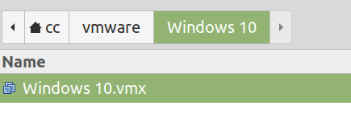
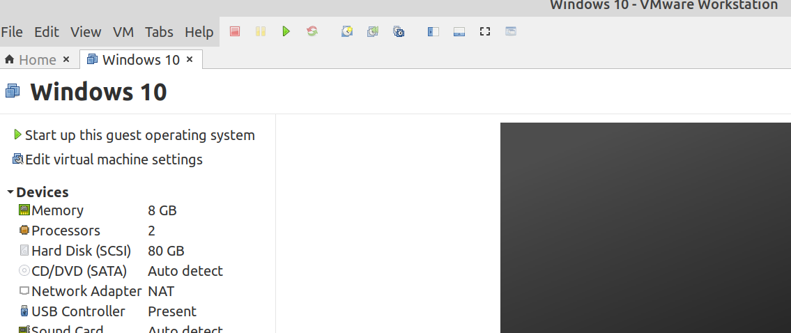
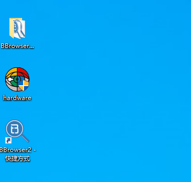
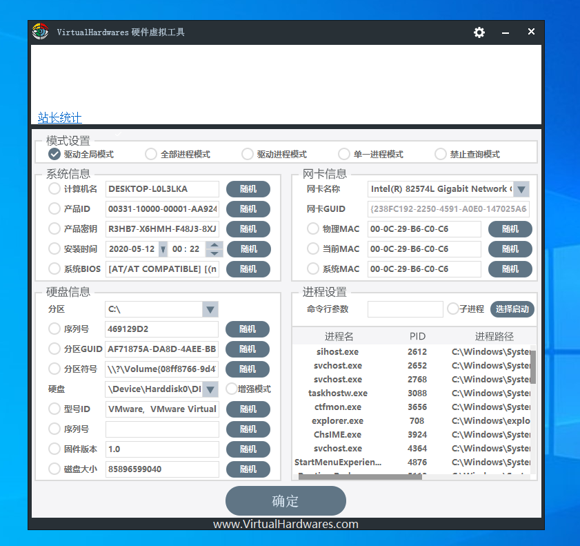
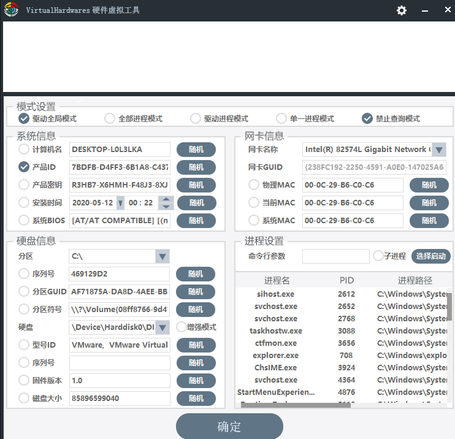

-   下载解压虚拟机文件win.tar.gz

-   打开vmware，选择File/Open，然后找到刚才解压的文件夹，找到.vmx后缀的文件，打开

    

    

-   打开后可以看到如下界面，点击绿色小三角运行虚拟机即可，等待虚拟机开机：

    

-   若提示选择"1. I copy it; 2 I move it"，选择"I copy it"即可

-   开机后可看到桌面文件如下：

    

-   运行 桌面上的hardware，关闭自动弹出的浏览器窗口，可以看到以下界面：

    

-   选择产品ID，点击随机，选择驱动全局模式和禁止查询模式，然后确定完成修改

    

-   打开桌面的BBrowser2，填写账号和密码登录，可以看到有新的50积分
-   注：修改产品ID时请先退出BBrowser2软件（可以不退出账号）
-   注：若hardware被windows defender隔离，请将其还原